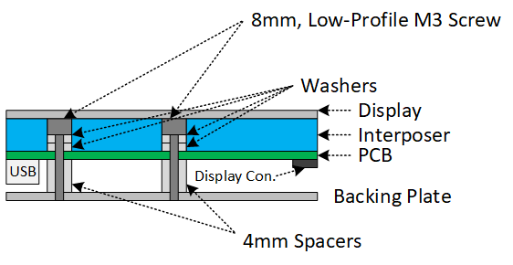

# Assembling a Nametag

## Components Needed
Note: Many of these parts are sold in volume, so check the quantity you're buying. 

Parts needed:
- 2x 8mm long, low-profile M3 screws
    - [McMaster-Carr P/N: 93070A064](https://www.mcmaster.com/93070A064/)
- 2x 4mm long, 4.5mm OD Aluminum spacers for M3 screws
    - [McMaster-Carr P/N: 9466A097](https://www.mcmaster.com/94669A097/)
- 2x washers for M3 screws; 0.4-0.6mm thick
    - [McMaster-Carr P/N: 8690A110](https://www.mcmaster.com/98690A110/)
- 1x Steel backing plate (1.5mm thick)
    - Produced by [SendCutSend](https://sendcutsend.com/)
        - G90 Galvanized Steel, 1.5mm thick
        - M3x0.5mm Tapping
- 1x Plastic interposer plate (3mm thick)
    - Produced by [SendCutSend](https://sendcutsend.com/)
        - Acrylic, 3mm thick
- 1x Assembled and tested PCB
- 1x E-Paper Display 
    - [Pervasive Displays: E2213JS0C1](https://www.pervasivedisplays.com/product/2-13-e-ink-displays/#ptab-4)
- A hex key or screwdriver for the screws
- Tape (Scotch tape seems to work well)
- Magnets (recommended: 2x ~5lb magnets)
    - A single 5 lb magnet holds the board up well, but to ensure it is almost impossible for it to fall off accidently, 2x magnets are recommended. 
    - [Apex Magnets P/N: M12x18RUBDI](https://www.apexmagnets.com/magnets/1-2-x-1-8-disc-rubber-coated-neodymium-magnet)

## Assembly

  

1. Connect the E-Paper Display to the PCB. The display should be facing up on the component side. 
    - To insert the display: Release the locking lever (lever will be facing up) and slide the cable into the slot. Press on the lever to lock. 
2. Flip the PCB over (component side face down).
3. Take out two M3 screws.
4. Place two washers on each screw.
5. Place the steel backing plate down on the work surface. Verify the screw holes line up with the PCBs holes.
6. Place the spacers on top of the steel mounting plate.
7. Carefully set the PCB on top of the spacers. 
    - Perfect spacer alignment is not required. The assembly self-aligns as both screws fall into place.
8. Take one of the screws (with washers attached) and put it through the holes of the PCB.
9. Gently press down on the PCB, such that the board is level, and turn the screw until it engages with the mounting plate below. When complete, the board shouldn't have a lot of wobble. 
10. Repeat this process for the second screw. Tighten both screws down when finished.
11. Apply tape to the back of the PCB. If using single-sided tape, fold it over to make it double-sided. Avoid applying tape near the programming holes. 
    - Two pieces of tape may be required to ensure the interposer is flush with the board.
12. Place the interposer plate on top of the tape.
13. Apply tape to the top of the interposer plate. Two pieces of tape may be needed to keep the display flush.  
14. Line-up and place the display on the interposer plate, then *gently* press down to ensure it adheres.